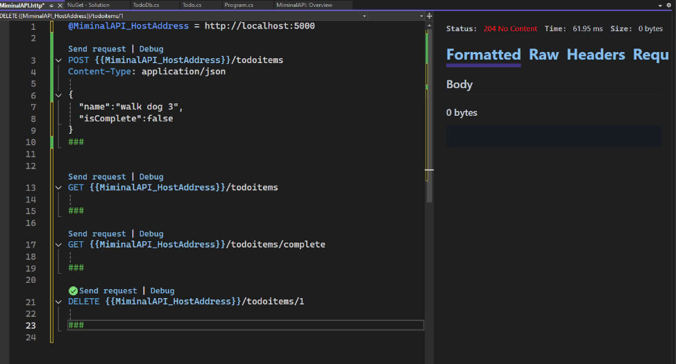

# Todo API - Minimal API với ASP.NET Core

## Giới thiệu
Dự án này là một ứng dụng Minimal API được phát triển bằng ASP.NET Core. API cung cấp các chức năng cơ bản để quản lý danh sách công việc (To-do list). 

Ứng dụng sử dụng **In-Memory Database** để lưu trữ dữ liệu tạm thời trong thời gian chạy.

---

## Chức năng chính
### 1. **Lấy danh sách công việc**
- **Endpoint**: `GET /todoitems`
- **Mô tả**: Trả về danh sách tất cả các công việc.
- **Request Body**: Không có.
- **Response**: Mảng các công việc dạng JSON.

```json
[
  {
    "id": 1,
    "name": "Đi bộ",
    "isComplete": true
  },
  {
    "id": 2,
    "name": "Mua sắm",
    "isComplete": false
  }
]
```


---

### 2. **Lấy danh sách công việc đã hoàn thành**
- **Endpoint**: `GET /todoitems/complete`
- **Mô tả**: Trả về danh sách các công việc đã được đánh dấu hoàn thành.
- **Request Body**: Không có.
- **Response**: Mảng các công việc dạng JSON.


---

### 3. **Lấy công việc theo ID**
- **Endpoint**: `GET /todoitems/{id}`
- **Mô tả**: Trả về thông tin của một công việc cụ thể theo ID.
- **Request Body**: Không có.
- **Response**:
  - Thành công: Thông tin công việc dạng JSON.
  - Thất bại: Trả về mã lỗi `404` nếu công việc không tồn tại.

```json
{
  "id": 1,
  "name": "Đi bộ",
  "isComplete": true
}
```


---

### 4. **Thêm công việc mới**
- **Endpoint**: `POST /todoitems`
- **Mô tả**: Thêm một công việc mới vào danh sách.
- **Request Body**: Dữ liệu JSON của công việc mới.

```json
{
  "name": "Học lập trình",
  "isComplete": false
}
```

- **Response**: Trả về thông tin công việc vừa thêm kèm mã trạng thái `201`.

```json
{
  "id": 3,
  "name": "Học lập trình",
  "isComplete": false
}
```


---

### 5. **Cập nhật công việc**
- **Endpoint**: `PUT /todoitems/{id}`
- **Mô tả**: Cập nhật thông tin của một công việc theo ID.
- **Request Body**: Dữ liệu JSON chứa thông tin mới.

```json
{
  "name": "Đi bộ buổi sáng",
  "isComplete": true
}
```

- **Response**:
  - Thành công: Mã trạng thái `204` (Không có nội dung).
  - Thất bại: Mã trạng thái `404` nếu công việc không tồn tại.


---

### 6. **Xóa công việc**
- **Endpoint**: `DELETE /todoitems/{id}`
- **Mô tả**: Xóa một công việc theo ID.
- **Request Body**: Không có.
- **Response**:
  - Thành công: Mã trạng thái `204` (Không có nội dung).
  - Thất bại: Mã trạng thái `404` nếu công việc không tồn tại.



---

## Hướng dẫn cài đặt
### Yêu cầu hệ thống
- Visual Studio 2022
- .NET SDK phiên bản 9.0 trở lên

### Các bước cài đặt
1. Clone dự án từ GitHub:
   ```bash
   git clone <repository-url>
   cd TodoApi
   ```
2. Mở dự án trong Visual Studio.
3. Chạy ứng dụng bằng cách nhấn **Ctrl + F5** hoặc sử dụng nút "Run".
4. API sẽ chạy tại `https://localhost:{port}`.

---

## Kiểm tra API
Sử dụng **Postman**, **cURL**, hoặc công cụ khác để kiểm tra các endpoint. Ví dụ:

### **Kiểm tra thêm công việc mới với cURL**:
```bash
curl -X POST https://localhost:{port}/todoitems \
-H "Content-Type: application/json" \
-d '{"name":"Học ASP.NET","isComplete":false}'
```


### **Kiểm tra lấy danh sách công việc**:
```bash
curl https://localhost:{port}/todoitems
```


---

## Ghi chú
- **Dữ liệu tạm thời**: Vì ứng dụng sử dụng **In-Memory Database**, toàn bộ dữ liệu sẽ bị mất khi khởi động lại ứng dụng.
- Để lưu dữ liệu lâu dài, cần tích hợp cơ sở dữ liệu thực tế như **SQL Server** hoặc **SQLite**.

---

## Tham khảo
- [ASP.NET Core Minimal APIs Documentation](https://learn.microsoft.com/en-us/aspnet/core/tutorials/min-web-api)
